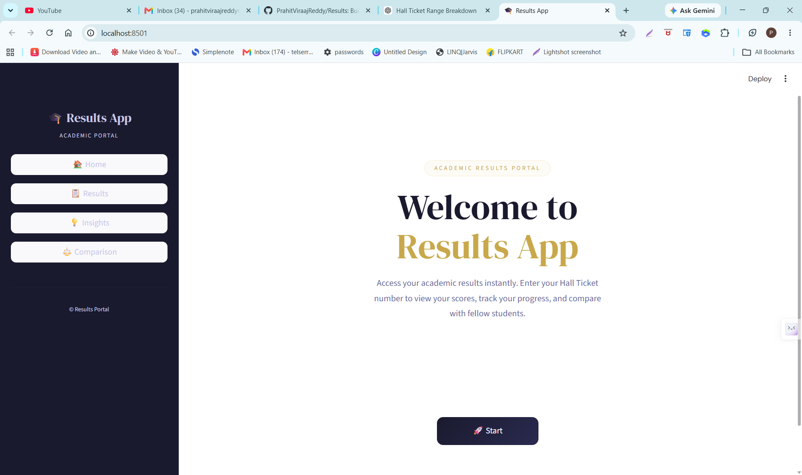
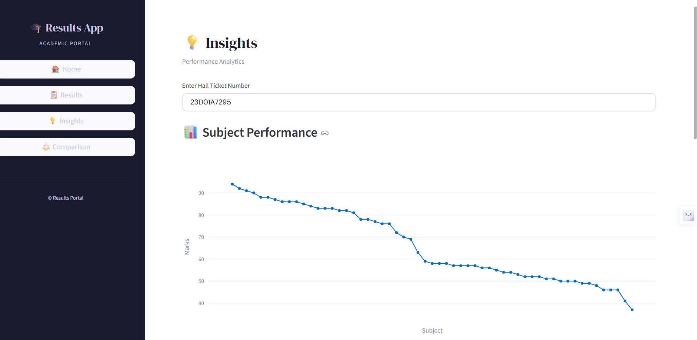

# 🎓 Results App

**Results App** is an academic performance analytics portal built with **Python, Pandas, OpenPyXL, Streamlit, Plotly, and ReportLab**.

The application converts semester-wise Excel result data into an interactive analytics interface where users can retrieve results, calculate SGPA/CGPA, explore subject performance, compare academic trends, and export PDF reports.

## 🌐 Live Demo

[Open the deployed Results App](https://academic-results.streamlit.app/)

## 📊 What This Project Demonstrates

This project focuses on a practical analytics workflow:

**Excel Data → Data Parsing → Data Transformation → Academic Metrics → EDA/Insights → Interactive Visualization → PDF Reporting**

It demonstrates skills relevant to **Data Analyst / BI / Reporting** roles:

- Excel-based data handling
- Pandas data transformation
- Data cleaning and reshaping
- KPI and metric calculation
- Trend analysis
- Comparative analysis
- Interactive dashboard development
- Automated report generation

## ✨ Key Features

- 📋 Semester-wise result lookup
- 🎓 SGPA and CGPA calculation
- 📊 Subject-level performance analysis
- 📈 Semester-wise SGPA progression
- 🏆 Best and weak subject identification
- ⚖️ Side-by-side student comparison
- 📉 Comparative performance trends
- 📄 PDF result report generation
- 📱 Responsive Streamlit interface

## 📸 Application Screens

### 🏠 Home


### 📋 Results


### 💡 Insights


### 📄 PDF Export


### ⚖️ Student Comparison


## 🧮 Analytics Logic

### SGPA

SGPA is calculated using the weighted grade-point formula:

**SGPA = Σ(Grade Point × Credits) / Σ(Credits)**

The application treats a semester as eligible for SGPA calculation only when there is no `F` or `Ab` grade.

### CGPA

CGPA is calculated from semester performance using credit-weighted SGPA values:

**CGPA = Σ(Semester SGPA × Semester Credits) / Σ(Total Credits)**

If required semester results are unavailable or contain unresolved backlogs, the application displays the corresponding status rather than silently treating the data as complete.

## 📊 Excel Data Model

The application expects an Excel workbook containing:

- A `Summary` sheet for student-level metadata
- One sheet per semester
- Subject-level columns containing:
  - Subject Code
  - Subject Name
  - Internal Marks
  - External Marks
  - Total Marks
  - Grade
  - Credits

The application transforms the wide semester-sheet structure into a long-format Pandas dataset for analysis and visualization.

## 🛠️ Tech Stack

| Technology | Purpose |
|---|---|
| **Python** | Application logic and analytics |
| **Pandas** | Data processing and transformation |
| **OpenPyXL** | Excel workbook parsing |
| **Streamlit** | Interactive web application |
| **Plotly** | Interactive performance charts |
| **ReportLab** | PDF report generation |

## 📁 Project Structure

```text
Results/
├── ui.py
├── results.xlsx
├── requirements.txt
├── README.md
├── .gitignore
├── .devcontainer/
│   └── devcontainer.json
└── images/
    ├── home.png
    ├── results.png
    ├── insights.png
    ├── export_pdf.png
    └── comparison.png
```

## 🚀 Run Locally

### 1. Clone the repository

```bash
git clone https://github.com/PrahitViraajReddy/Results.git
cd Results
```

### 2. Install dependencies

```bash
pip install -r requirements.txt
```

### 3. Provide the Excel workbook

Place a compatible `results.xlsx` file in the project root.

### 4. Start Streamlit

```bash
streamlit run ui.py
```

## 🔐 Data Privacy

The application processes student-level academic records, so **public deployments should use synthetic, anonymized, or otherwise appropriately authorized data**.

Before publishing a workbook containing real student records, remove or anonymize personally identifying information and confirm that the data is appropriate for public use.

## 🔮 Future Improvements

Potential extensions include:

- Authentication and role-based access
- Admin analytics dashboard
- Batch-level performance analytics
- Branch-wise performance analysis
- Database-backed data storage
- Automated data validation
- Additional KPI and reporting views

## 👤 Author

**Prahit Viraaj Reddy**

- GitHub: [@PrahitViraajReddy](https://github.com/PrahitViraajReddy)
- Live App: [academic-results.streamlit.app](https://academic-results.streamlit.app/)

## ⚠️ Disclaimer

This project is intended as an educational and portfolio project. Results and analytics are dependent on the quality and completeness of the supplied Excel data.
